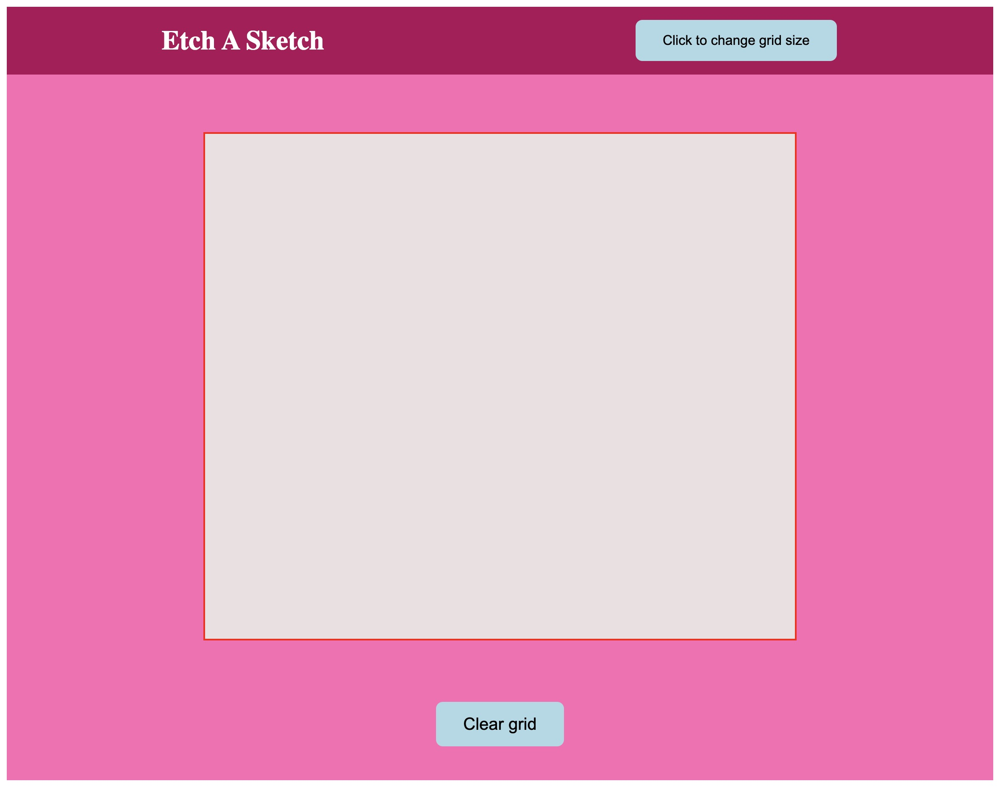

# Etch A Sketch

A browser-based Etch A Sketch application created with HTML, CSS, and JavaScript. This project is part of [The Odin Project](https://www.theodinproject.com/lessons/foundations-etch-a-sketch) curriculum and demonstrates core skills in DOM manipulation.



## Live Demo

*Click [here](https://ayoroq.github.io/etch-a-sketch/) to see a live demo*

---

## Features

- **Dynamic Grid:** The drawing grid is generated dynamically using JavaScript.
- **Interactive Drawing:** Draw on the canvas by simply hovering your mouse over the grid squares.
- **Random Colors & Shading:** Each new square you touch is assigned a random color. Passing over the same square again increases its opacity, creating a darkening/shading effect.
- **Customizable Grid Size:** Click the "Change grid size" button to enter a new dimension for the canvas (up to 100x100).
- **Clear Button:** Instantly reset the canvas to a blank state without reloading the page.

---

## Technologies Used

- **HTML5:** For the basic structure of the application.
- **CSS3:** For styling, layout (Flexbox), and visual effects.
- **JavaScript:** For all the core logic, including:
  - Dynamic grid creation and manipulation.
  - Event handling for mouseovers and button clicks.
  - Implementing the drawing and coloring logic.

---

## How to Use

1.  Clone this repository to your local machine:
    ```bash
    git clone https://github.com/ayoroq/etch-a-sketch.git
    ```
2.  Navigate to the project directory.
3.  Open the `index.html` file in your favorite web browser.
4.  Start drawing!

---

## Project Insights & Challenges

This project was a great exercise in manipulating the DOM. Some of the key challenges and learning points included:

- **Efficient Grid Generation:** Learning the most efficient way to create, append, and clear a large number of DOM elements without causing performance issues.
- **Event Listener Logic:** Implementing the mouseover event to not only change the color on the first pass but also to track and modify the opacity on subsequent passes.
- **Refactoring for Clarity:** Initially, the code was functional but could be hard to read. Refactoring the JavaScript into more organized functions for creating the grid, clearing it, and handling drawing made the project much more maintainable.

---

## Future Improvements

- **Color Picker:** Adding a color wheel or a set of color buttons to allow the user to choose their drawing color.
- **"Rainbow Mode":** Maybe a button that makes every square a different random color as you draw.
- **Eraser Tool:** A button to switch the drawing mode to an "eraser" that resets squares to their default white background.

---

## Acknowledgements

A big thank you to **The Odin Project** for providing the project idea and the foundational knowledge required to build it.